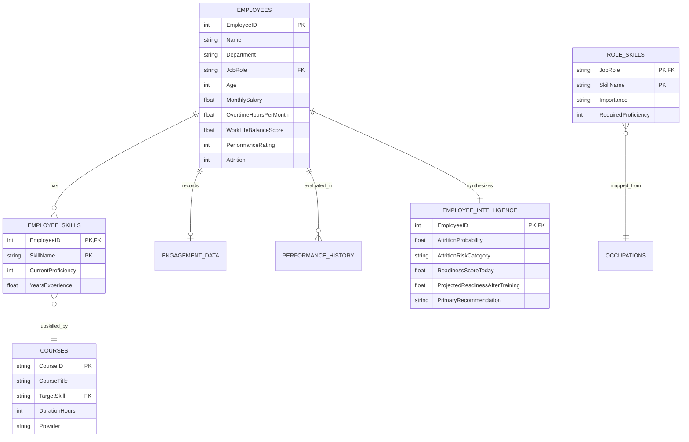

# Enterprise HR AI — Data Relationships & Entity Architecture

This document formalizes the entity relationships, primary keys, foreign keys, and mapping rules across all raw and processed tables in the Enterprise HR AI system.

---

## Relational Mapping Table

| Source Entity | Target Entity | Foreign Key | Cardinality | Business Purpose |
| :--- | :--- | :--- | :--- | :--- |
| `employees.csv` | `employee_skills.csv` | `EmployeeID` | 1-to-Many | Maps current employee technical competencies |
| `employees.csv` | `role_skills.csv` | `JobRole` | Many-to-Many | Benchmarks worker skills against role requirements |
| `employee_skills.csv` | `courses.csv` | `SkillName` -> `TargetSkill` | Many-to-One | Provides targeted course matches for missing competencies |
| `employees.csv` | `engagement_data.csv` | `EmployeeID` | 1-to-1 | Provides pulse sentiment, burnout, and WLB indicators |
| `employees.csv` | `employee_intelligence.csv` | `EmployeeID` | 1-to-1 | Unified 360 master table powering API & Dashboard |
